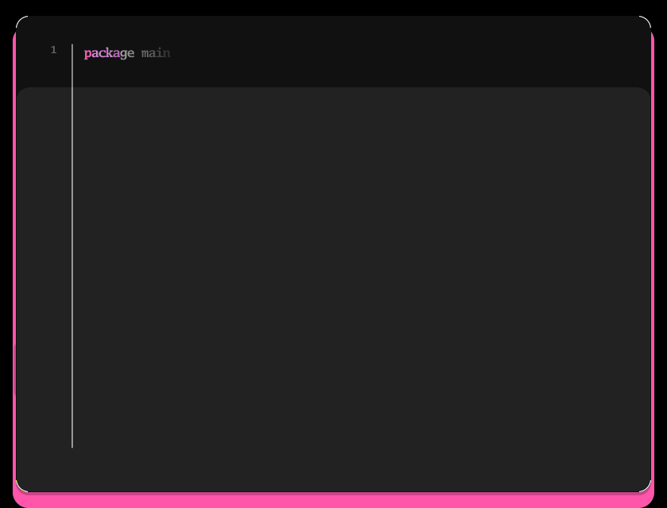
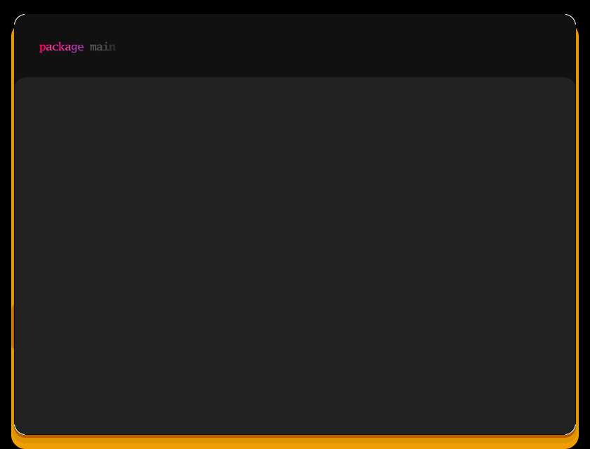
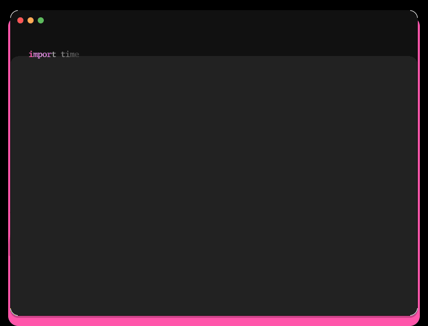
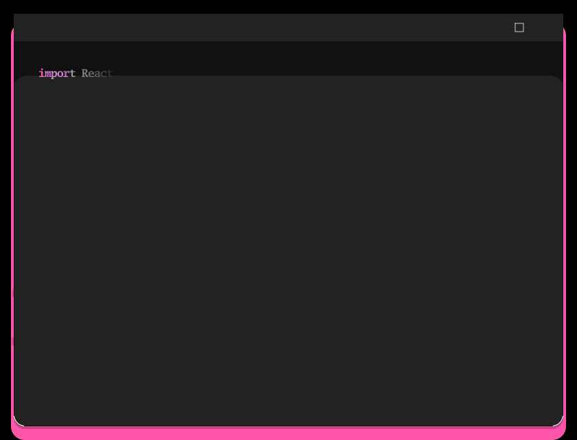
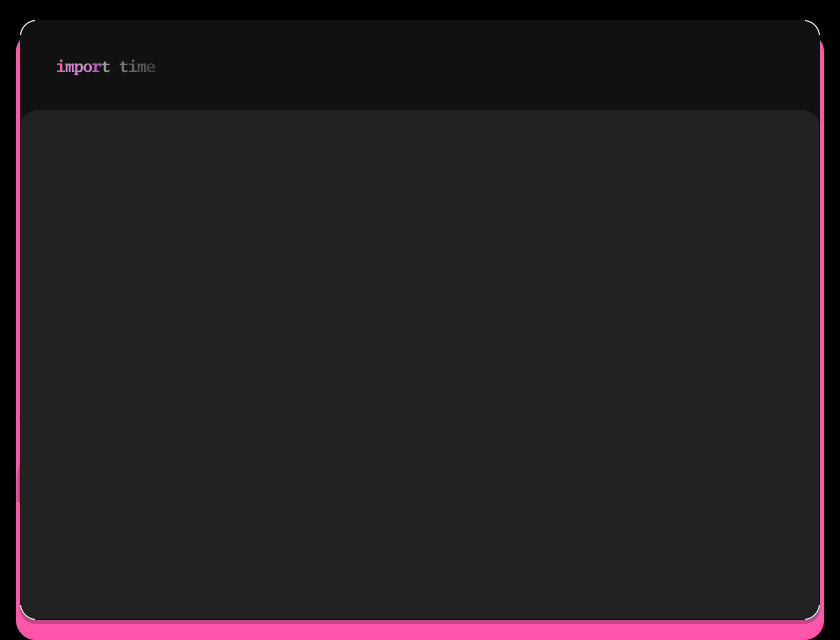
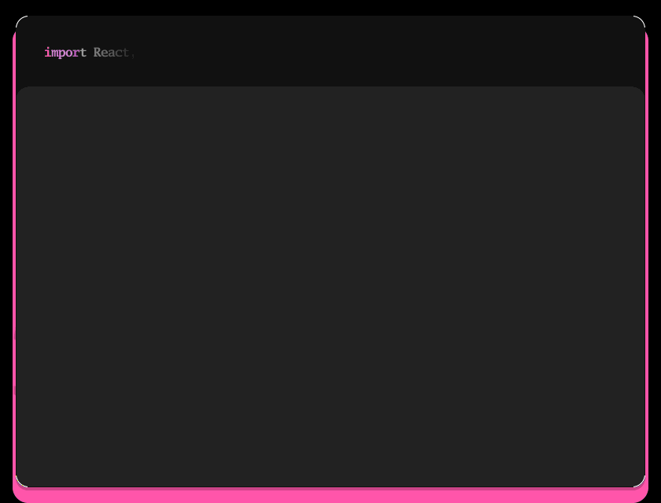
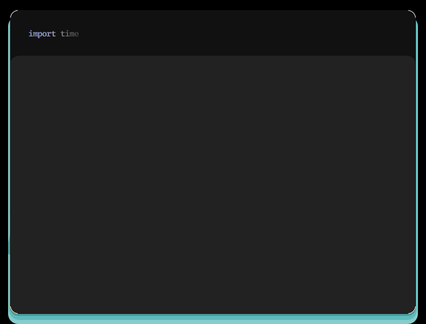
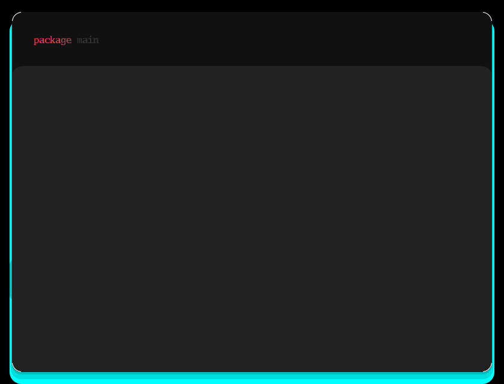

# gif-my-code 🎬

> **The only free CLI tool that creates animated code GIFs with line highlighting**

Perfect for Twitter posts, tutorials, README files, documentation, and portfolio demos.



---

## 🎯 Why gif-my-code?

| Feature | gif-my-code | Snappify | Carbon.now.sh | Ray.so |
|---------|-------------|----------|---------------|--------|
| **Price** | ✅ FREE | 💰 $5-30/mo | ✅ FREE | ✅ FREE |
| **Animations** | ✅ Yes | ✅ Yes | ❌ Static only | ❌ Static only |
| **Line Highlighting** | ✅ Yes | ✅ Yes | ❌ No | ❌ No |
| **CLI/Scriptable** | ✅ Yes | ❌ Web only | ❌ Web only | ❌ Web only |
| **Works Offline** | ✅ Yes | ❌ No | ❌ No | ❌ No |
| **Open Source** | ✅ MIT | ❌ Proprietary | ⚠️ Limited | ⚠️ Limited |

---

## ✨ Features

### 🎨 Beautiful Syntax Highlighting
- **250+ languages** supported via [chroma](https://github.com/alecthomas/chroma)
- **50+ color themes** (Dracula, Monokai, Nord, GitHub, and more)
- **Auto language detection** from file extensions



### ⚡ Two Animation Styles
- **Typing animation** - Classic character-by-character reveal
- **Laser reveal** - Fluid line-by-line scanner effect (NEW!)


### 📍 Line Highlighting
Perfect for tutorials, bug explanations, and code reviews. Highlight specific lines with warm accent colors.

```bash
gif-my-code example.go --highlight "5,7-9" --line-numbers
```


### 🪟 Professional Window Chrome
Add macOS or Windows styling for that polished, professional look.




### 🎯 More Features
- ✅ **Customizable speed** - Control animation timing
- ✅ **Configurable sizing** - Width, font size, FPS
- ✅ **Line numbers** - Optional line numbering
- ✅ **HiDPI support** - Retina-quality output
- ✅ **No cursor option** - Clean screenshots
- ✅ **Gradient backgrounds** - Depth and visual polish
- ✅ **Drop shadows** - Professional dimension

---

## 🚀 Installation

### Option 1: From Source
```bash
git clone https://github.com/forbiddenlink/gif-my-code.git
cd gif-my-code
go build -o gif-my-code
```

### Option 2: Go Install
```bash
go install github.com/forbiddenlink/gif-my-code@latest
```

### Option 3: Download Binary
Download the latest release from the [Releases page](https://github.com/forbiddenlink/gif-my-code/releases).

**Requirements:** Go 1.20+

---

## 📖 Quick Start

### Basic Usage
```bash
# Generate animated GIF from any code file
gif-my-code example.go

# Specify output path
gif-my-code example.py -o demo.gif

# Use a different theme
gif-my-code example.js --theme monokai

# Faster animation
gif-my-code example.tsx --speed 2.0
```

### Advanced Examples

#### Tutorial Mode (with line highlighting)
```bash
gif-my-code tutorial.py \
  --highlight "5,7-9" \
  --line-numbers \
  --theme dracula \
  -o tutorial-demo.gif
```

#### Professional Look (with window chrome)
```bash
gif-my-code component.tsx \
  --window macos \
  --theme monokai \
  --width 1000 \
  -o professional-demo.gif
```

#### Laser Reveal (cinematic effect)
```bash
gif-my-code main.go \
  --laser \
  --line-numbers \
  --theme nord \
  -o laser-demo.gif
```

#### Combine Everything
```bash
gif-my-code app.py \
  --window macos \
  --highlight "3,5-7" \
  --laser \
  --line-numbers \
  --theme dracula \
  --width 1000 \
  --speed 1.5 \
  -o complete-demo.gif
```

---

## 🎨 Visual Examples

### Multiple Languages

**Go:**


**Python:**


**React/TypeScript:**


### Theme Variations

**Monokai:**


**Nord:**


**GitHub:**


---

## ⚙️ All Options

```bash
gif-my-code [file] [flags]

Flags:
  -t, --theme string       Color theme (default "dracula")
  -s, --speed float        Typing speed multiplier (default 1.0)
  -o, --output string      Output file path (default "code.gif")
  -w, --width int          Image width in pixels (default 800)
  -f, --font-size float    Font size (default 16)
  -l, --lang string        Force language (auto-detect if not provided)
      --highlight string   Lines to highlight (e.g., '5,7-9')
      --line-numbers       Show line numbers
      --window string      Window style: macos, windows, or none (default "none")
      --laser              Use fluid laser reveal animation (default true)
      --no-cursor          Disable cursor animation
      --hidpi              Render at 2x resolution (Retina)
      --fps int            Frames per second (default 30)
  -h, --help               help for gif-my-code
```

---

## 🎯 Use Cases

### 🐦 Social Media
Create eye-catching code demos for Twitter, LinkedIn, and Dev.to posts.

### 📚 Tutorials & Education
Show code snippets coming to life in educational content.

### 📄 Documentation
Add animated examples to README files and project documentation.

### 🎨 Portfolios
Demonstrate your projects with cinematic code reveals.

### 👀 Code Reviews
Highlight specific lines to explain bugs or improvements.

### 🎤 Presentations
Professional-looking code snippets for conference talks and demos.

---

## 🎨 Popular Themes

Run `gif-my-code themes` to see all 50+ themes. Here are the most popular:

- **`dracula`** - Dark theme with vibrant colors (default)
- **`monokai`** - Classic Sublime Text theme
- **`nord`** - Cool, calm Nordic palette
- **`github`** - GitHub's light theme
- **`solarized-dark`** - Low contrast dark
- **`gruvbox`** - Retro groove colors
- **`tokyo-night`** - Modern dark theme
- **`one-dark`** - Atom's default theme

---

## 🌐 Supported Languages

Auto-detection works for **250+ languages** including:

**Web:** HTML, CSS, JavaScript, TypeScript, React/JSX, Vue, Svelte  
**Backend:** Go, Python, Ruby, PHP, Java, C#, Rust, Kotlin  
**Systems:** C, C++, Zig, Assembly  
**Data:** JSON, YAML, TOML, XML, SQL  
**Shell:** Bash, Zsh, PowerShell  
**Docs:** Markdown, LaTeX, reStructuredText

And many more! If chroma supports it, so does gif-my-code.

---

## 🛠️ Development

### Project Structure
```
gif-my-code/
├── cmd/                  # CLI commands (Cobra)
├── internal/
│   ├── parser/          # File reading & language detection
│   ├── highlight/       # Syntax highlighting (chroma)
│   ├── render/          # Image rendering (gg)
│   ├── animator/        # Frame generation
│   └── encoder/         # GIF encoding
├── examples/            # Example code files
├── demos/               # Showcase GIFs
└── assets/              # Fonts and resources
```

### Building from Source
```bash
# Clone the repo
git clone https://github.com/forbiddenlink/gif-my-code.git
cd gif-my-code

# Install dependencies
go mod download

# Build binary
go build -o gif-my-code

# Test it
./gif-my-code examples/example.go
```

### Running Tests
```bash
# Generate test GIFs
./gif-my-code examples/example.go -o test-go.gif
./gif-my-code examples/example.py -o test-py.gif
./gif-my-code examples/example.tsx -o test-tsx.gif

# Test line highlighting
./gif-my-code examples/example.go --highlight "5,7-9" -o test-highlight.gif

# Test window chrome
./gif-my-code examples/example.py --window macos -o test-macos.gif
```

---

## 🚧 Roadmap

### ✅ v1.0 (Current)
- [x] Typing & laser reveal animations
- [x] 250+ languages with syntax highlighting
- [x] 50+ color themes
- [x] Line highlighting
- [x] Window chrome (macOS & Windows)
- [x] CLI interface with all options

### 🎯 v1.1 (Next - Community Driven)
Based on your feedback! Vote on features in [Issues](https://github.com/forbiddenlink/gif-my-code/issues).

**Most Requested:**
- [ ] Custom fonts (JetBrains Mono, Fira Code, etc.)
- [ ] Custom highlight colors
- [ ] Export at 2x/3x resolution
- [ ] Watermark option (branding)
- [ ] Stdin support (pipe code directly)

### 🔮 v1.2 (Future)
- [ ] Diff mode (show added/removed lines in green/red)
- [ ] Annotations (arrows, boxes, comments)
- [ ] MP4 export (higher quality, smaller files)
- [ ] Batch processing (generate GIFs for all files)

### 🚀 v2.0 (Long-term)
- [ ] Web version (no CLI needed)
- [ ] VSCode extension
- [ ] GitHub Action integration
- [ ] API access

**Want a feature?** [Open an issue](https://github.com/forbiddenlink/gif-my-code/issues/new) or upvote existing ones!

---

## 🤝 Contributing

Contributions are welcome! Here's how you can help:

### Ways to Contribute
- 🐛 **Report bugs** - Found an issue? [Open a bug report](https://github.com/forbiddenlink/gif-my-code/issues/new)
- 💡 **Suggest features** - Have an idea? [Request a feature](https://github.com/forbiddenlink/gif-my-code/issues/new)
- 📝 **Improve docs** - Fix typos, add examples, clarify instructions
- 🔧 **Submit PRs** - Fix bugs or implement features
- ⭐ **Star the repo** - Show your support!
- 📢 **Share your GIFs** - Tweet your creations and tag us!

### Development Setup
```bash
# Fork the repo on GitHub
# Clone your fork
git clone https://github.com/YOUR_USERNAME/gif-my-code.git
cd gif-my-code

# Create a branch
git checkout -b feature/your-feature-name

# Make changes, test thoroughly
go build && ./gif-my-code examples/example.go

# Commit and push
git commit -m "feat: add your feature"
git push origin feature/your-feature-name

# Open a Pull Request on GitHub
```

See [CONTRIBUTING.md](CONTRIBUTING.md) for detailed guidelines.

---

## 📝 License

MIT License - see [LICENSE](LICENSE) file for details.

**TL;DR:** Free to use, modify, and distribute. Just keep the license notice.

---

## 🙏 Acknowledgments

Built with these amazing open-source libraries:

- **[chroma](https://github.com/alecthomas/chroma)** - Fast, powerful syntax highlighting engine
- **[gg](https://github.com/fogleman/gg)** - 2D graphics library for Go
- **[cobra](https://github.com/spf13/cobra)** - Modern CLI framework

Special thanks to the Go community for excellent tooling and documentation.

---

## 💬 Questions or Feedback?

- 💬 **GitHub Discussions:** [Ask questions, share ideas](https://github.com/forbiddenlink/gif-my-code/discussions)
- 🐛 **Issues:** [Report bugs or request features](https://github.com/forbiddenlink/gif-my-code/issues)
- 🌐 **Portfolio:** [elizabethannstein.com](https://elizabethannstein.com)
- 🐦 **Twitter:** Share your GIFs with `#gifmycode`

---

## ⭐ Show Your Support

If this tool helped you create awesome code GIFs:

1. **Star this repo** ⭐
2. **Share your creations** on social media (tag `#gifmycode`)
3. **Tell other developers** about it
4. **Consider contributing** - every PR helps!

---

**Made with 🐾 by [forbiddenlink](https://github.com/forbiddenlink)**

*Creating animated code GIFs should be free, fast, and fun. Happy coding!* 🎬
